# Lucid

Lucid is an immersive text-based adventure game where players navigate
through a series of rooms, solving puzzles and making choices that affect 
their journey. The game is designed to challenge the players problem solving skills,
while also encouraging deep reflection on their personal priorities. As players 
progress, they must make decisions that influence the outcome, ultimately
leading to a powerful conclusion about family and life choices.

The live link can be found here - [Lucid](https://lucid-escape-2638c5d9523b.herokuapp.com/)

## How to Play
- The player navigates through a series of interconnected rooms, each with its own set of challenges and items to interact with.
- The player must make decisions, such as picking up items, unlocking doors and choosing directions to move.
- Each choice impacts the game, with certain items unlocking new paths and others providing essential clues
- The player must manage their inventory carefully, using items at the right time to progress
- The game is designed to be completed one session, providing a meaningful experience that leaves a lasting impression
- The ultimate goal is to reach te end of the game, where the player is presented with a choice that reflects the theme of prioritizing family and making the most of one's time.

## Site Owner Goals
- To provide the player with an engaging and thought provoking experience that combines puzzle solving with deep narrative elements.
- To create seamless and intuitive user interface that allows players to focus on the story and the choices they make.
- To encourage players to reflect on their personal priorities and the impact of their decisions, both in the game and in real life.

## User Stories

- ### As a user I want to:
  - Understand the main objective of the game and the narrative it presents
  - Be engaged by the puzzles and choices that challenge my problem-solving skills
  - Be required to think critically about the items I collect and how to use them to progress
  - Clearly see the options available to me at each stage of the game, such as directions to move or items to interact with.
  - Experience a narrative that unfolds based on the choices i make, leading to a satisfying conclusion.

## Logic Flow
In developing "Lucid", a clear and structured logic flow was essential to ensure a smooth and engaging player experience. By mapping out the game's progression, I was able to identify the necessary functions, the timing of their execution, and how the different elements of the game would interact to create a cohesive narrative.

### Initial Design and Object Oriented Principles
At the outset, I focused on using the principles of Object-Oriented programming (OOP) to structure the game. This approach was instrumental in organzing the gmaes logic into manageable components, each with specific responsibilities:
- #### Rooms:
  Each room in the game is an object with properties such as its description, exits, and items. This encapsulation allows for easy management of room states and interactions.
- #### Items:
  Items are objects that players can interact with, collect, and use within the game. Each item has a name and description, and its interactions are defined by methods within the Item class.
- #### Player:
  The player is represented by an object that tracks their current location, inventory, and the decisions they make throughout the game. This allows the game to update and repspond dynamically to the player's actions.

### Game Flow
The game's flow is designed to guide the player though a series of decisions, each of which impacts their progression. The key stages of the game include:
- #### 1. Starting the Game:
  The player begins in a specific room, with an initial description setting the scene. They are presented with a set of options- directions to move or items to interact with.
- #### 2. Player Movement:
  The player chooses a direction to move, and the game logic checks whether this move is possible based on the current room's exits. If valid, the player is moved to a new room, and a new description is provided. This stage is crucial for maintaining immersions, as the game needs to seamlessly update the narrative based on the players choices.
- #### 3. Item Interaction:
  Throughout the game, the player encounters various items. Each item can be taken, used, or examined, depending on its role in the story. The logic ensures that the use of certain items unlocks new paths or provides hits necessary for progression.
- #### 4. Decision Making and Consequences:
  As the player interacts with the environment, they are presented with decisions that influence the outcome of the game. These decisions may open new paths, close off others, or change the narrative direction. The logic here ensures that every choice fells meaningful and impacts the game's progression.
- #### 5. Game Conclusion:
  The game culminates in a final decision, where the players choices throughout the game are reflected in the outcome. The logic ensures that this conclusion ties together the narrative threads, providing a satisfying and thought provoking resolution.

## Iterative Development
As the game developed, the logic flow evolved to incorporate new ideas and refinements. While the initial design provided a strong foundation, the iterative process allowed for adjustments that enhanced the games depth and player engagement. For example, additional checks were added to ensure that the players inventory was correctly managed, and new narrative branches were introduced to increase replayability.

## Features

### Title and introduction section:
- When the user enters the site they are greeted with a simple welcome message and an invitation to type begin and press enter to start the game.

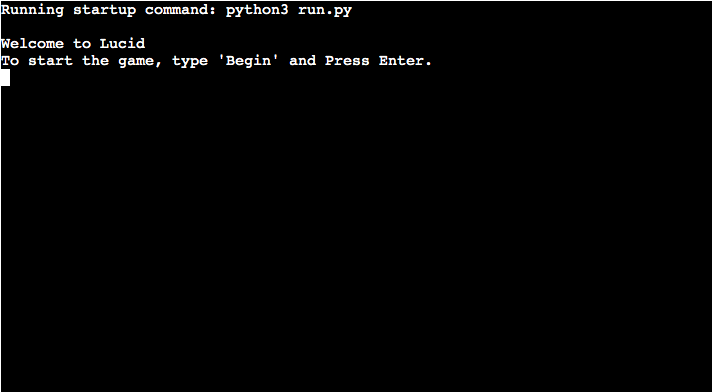

### Beginning the game:
Once the user types begin and presses enter, they are provided with a description of the bedroom. 

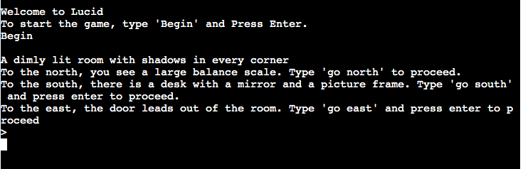

### First Moves:
Should the player navigate north as their first move, they will be given a description of a balance scales and told they need to find something to balance it out. 

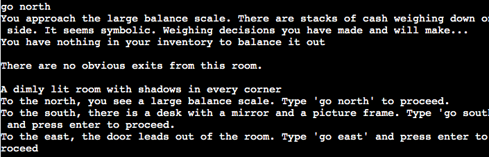

Likewise, should the player select to move east first they will be told that the door is locked

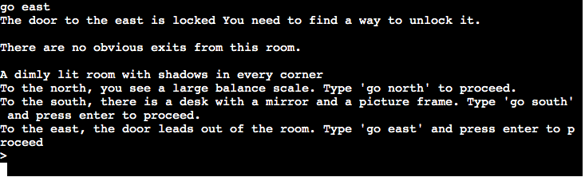

### Bedroom Puzzle:

If the player moves 'south' they will be asked to take or leave the mirror and picture frame on the desk

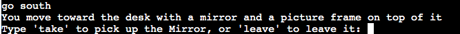
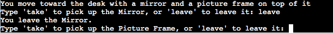

After picking up items on the desk and going north again the player will be prompted to use one of the items on the balance scale to balance it out. After placing the picture frame on the scales the door to the east will unlock and the player will progress to the next room. 

### The office

Should the player go west when first entering the office they will be told the door is locked. 

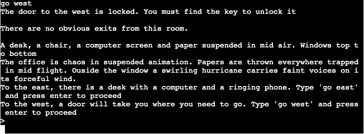

Should the player move 'east', they will again be asked to take or leave a ringing phone and origami key. When the player takes the origami key they are promted to enter 'go west' and exit the room. 

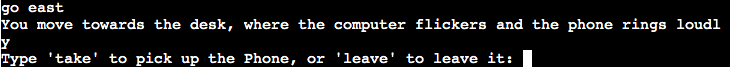
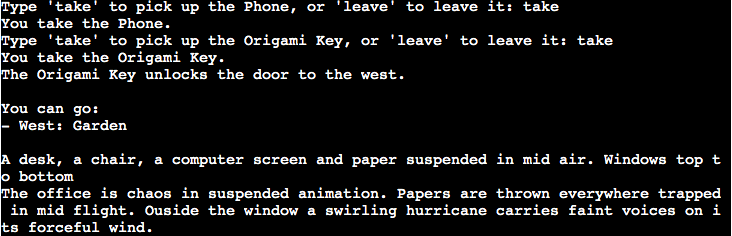
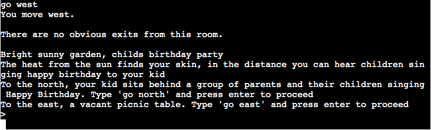

### The Garden
After exiting the office the player is brought to the garden. Should they choose to move north
as their firts move. They are advised that they can see a group of people singing happy birthday to their child but they themselves cannot reach their child. 

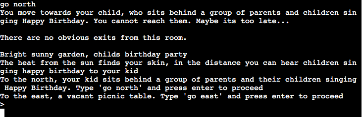

Moving east provides the player the opportunity to pick up a knife. After doing so the scene they previously observed to the north changes to a 2d image and they are given the opportunity to cut an exit out of the picture and exit the room. 

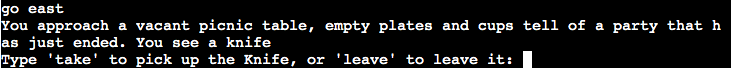
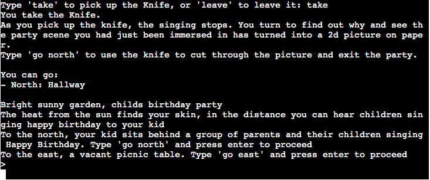
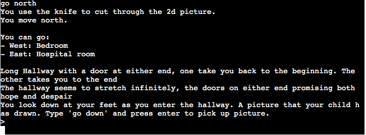

### The Hallway

The player enters the hallway after exiting the garden. Our final room. Upon entering the halway they are prompted to pick up a picture their child had made for them. 

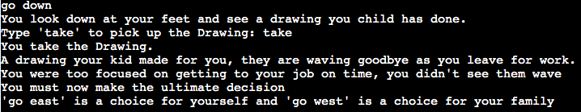

They are then presented with the final decision of the game. If they go 'east' the game restarts and if they go 'west' they complete the game and it ends.

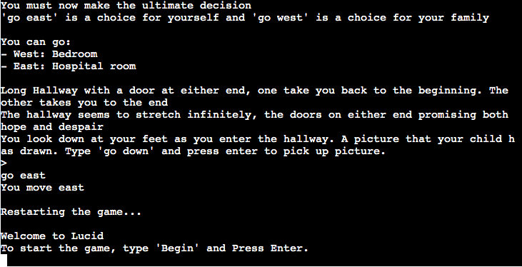
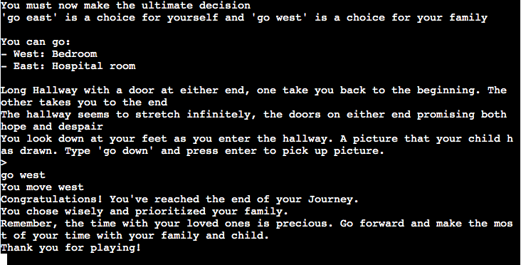

## Testing
### Input testing
The user inputs were thouroughly tested to ensure all input data is handled correctly and appropriate feedback is given:
- #### Direction Input:
  Tested to ensure that the player can input directions using both uppercase and lowercase letters. The game also provides error message if the input is not one of the expected directions.
- #### Item Interaction:
  Checked that the player can interact with items using commands such as 'take', 'use' and 'inspect'. If the player tries to interact with an item that does not exist, an error message is displayed.
- #### Invalid Inputs:
  All invalid inputs were tested, ensuring the game handles them gracefuly by prompting the user to input a valid command.

### Game Functionality Testing
The game was extensively tested to verify that all features worked as intended:
- #### Room Navigation:
  Verified that the player can move between rooms according to the available exits, and that the game provides the correct description of each room upon entry.
- #### Item Usage:
  Confirmed that items collected by the player can be used to unlock doors or solve puzzles. For instance, using the "Knife" in the garden opens the path to the hallway.
- #### Inventory Management:
  Checked that items are correctly added to and removed from the players inventory and that inventory items are displayed when the player requests to view them.
- #### Game Ending:
  Tested the game's ending conditions, ensuring that the correct narrative and outcomes are displayed based on the players choices.

### Edge Case Testing
Several edge cases were tested, including:
- #### No Items Collected:
  Ensured the game responds correctly if the player reached the end with out collecting certian items.
- #### Repeating Actions:
  Verified that repeating certain actions (like trying to move through a locked door) provides consistent feedback without causing errors.
- #### Extreme Inputs:
  Tested inputs like long strings, empty inputs, and invalid commands to ensure the game handles these gracefully

## Bugs and Resolutions
Throughout the development and testing process, any bugs identified were logged diagnosed and resolved. This ensures that the game functions as intended, providing a smooth and engaging experience for players.

## Programs Used
- #### Github:
  Used for version control and to store project repository.
- #### Heroku:
  Used to deploy the live version of the game.

## Known Bugs
- #### Direction Input Edge Cases:
  If the player inputs a direction that is technically valid but contextually inappropriate (e.g. 'north' when there is no north exit), the game may loop back to the input prompt without providing feedback. This will be addressed in a future update by refining input validation.

## Fixed bugs
- #### Repeated Item Interaction:
  Initially, the game allowed the player to repeatedley 'take' an item even after it had been removed from the room. This was fixed by ensuring that items are removed from the room's item list immediately upon being picked up.
- #### Unlocked Door Misbehaviour
  A bug was discovered where doors would remain locked even after the player used the correct item to unlock them. This was due to the exit not being properly updated in the room's exit dictionary. The issue was resolved by ensuring the game state is updated immediately after the player uses the key item.

## Deployment
The 'Lucid' game was deployed via Heroku. Below are the steps taken to deploy the game:

1. Ensure all dependencies are listed in requirements.txt by running pip3 freeze > requirements.txt.
2. Log in to [Heroku](https://dashboard.heroku.com/apps) or create an account.
3. On the main page click the button labelled New in the top right corner and from the drop-down menu select "Create New App".
4. Enter a unique and meaningful app name.
5. Next select your region.
6. Click on the Create App button.
7. Click on the Settings Tab and scroll down to Config Vars.
8. Click Reveal Config Vars and enter port into the Key box and 8000 into the Value box and click the Add button.
9. Input CREDS and the content of your Google Sheet API creds file as another config var and click add.
10. In the next Key box enter OXFORD_API_APP_ID and add your unique ID to the value box. 
11. In the next Key box enter OXFORD_API_APP_KEY and add your unique key to the value box. 
12. Next, scroll down to the Buildpack section click Add Buildpack select Python and click Save Changes
13. Repeat step 11 to add node.js. Note: The Buildpacks must be in the correct order. If not click and drag them to move into the correct order.
14. Scroll to the top of the page and choose the Deploy tab.
15. Select Github as the deployment method.
16. Confirm you want to connect to GitHub.
17. Search for the repository name and click the connect button.
18. Scroll to the bottom of the deploy page and either click Enable Automatic Deploys for automatic deploys or Deploy Branch to deploy manually. Manually deployed branches will need re-deploying each time the repo is updated.
19. Click View to view the deployed site.

The site is now live and operational.

## Resources Used
- #### W3Schools:
  Used as a reference for python syntax and functions
- #### Stack Overflow:
  Consulted for various coding challenges, including logic flow and bug fixes.

## Acknowledgements
- #### Family and Friends
  For playtesting the game and offering valuable insights that helped refine the gameplay experience.
- #### Mentor
  For being so generous with his expert advice and patience. 
